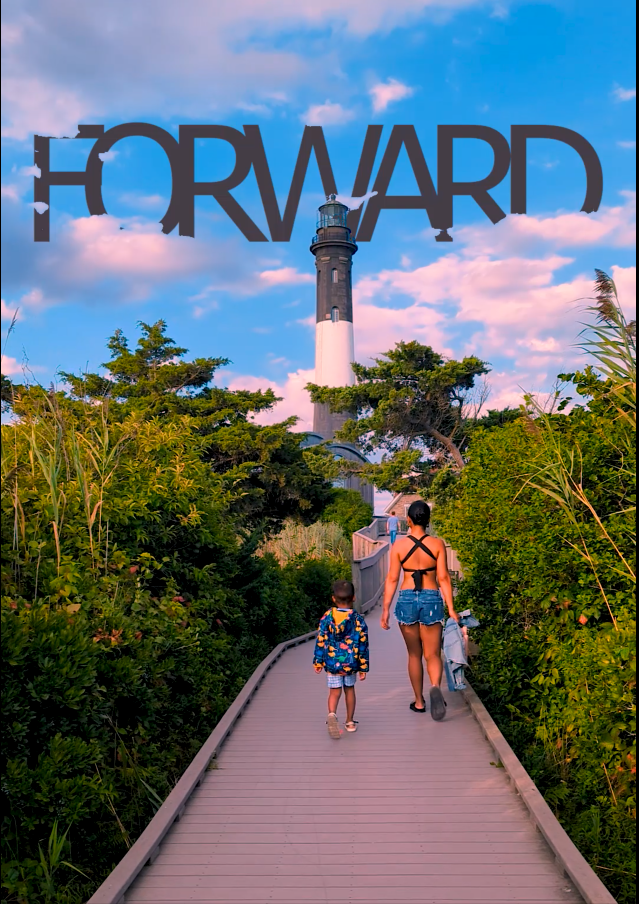
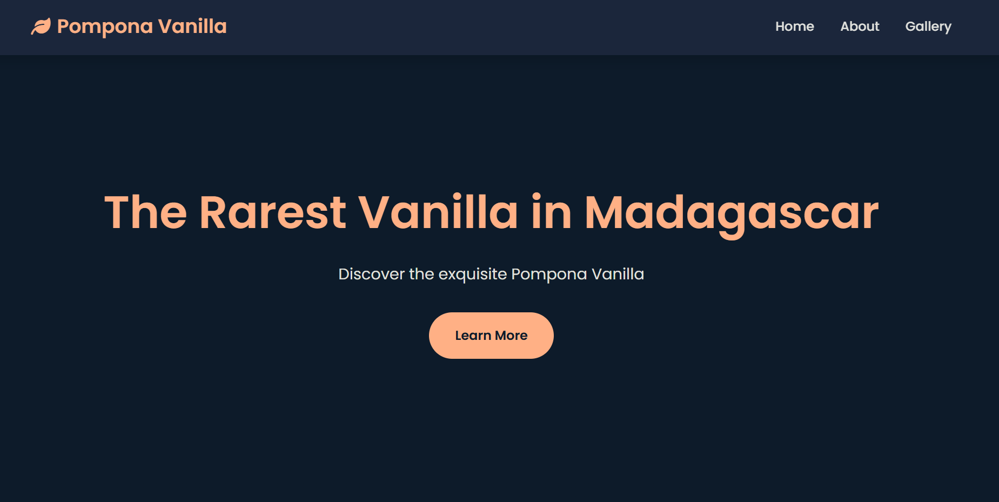

<!-- HERO -->
<h1 align="center">PXARTISAN</h1>
<h3 align="center">Graphic Designer & Video Editor</h3>

Clean, modern visuals and cinematic edits — built with purpose, not just polish.

  
  
  
  
  
  

📩 Open to freelance, remote, and creative collaborations

  <a href="mailto:pxartisanlab@gmail.com">pxartisanlab@gmail.com</a> · 
  <a href="https://www.linkedin.com/in/herin-r-807221402">LinkedIn</a>

 

## About

I design and edit visual content that communicates fast: thumbnails, posters, flyers, brochures, and social media assets, plus short-form video editing with color grading and sound design.

Every project starts with the same question — what does this need to *do*? From there I build compositions that are clean, purposeful, and built to hold attention. The photo retouching carousel below breaks that process down step by step, from raw shot to finished edit.

I also work across HTML, CSS, and JavaScript, which means I understand how design holds up once it becomes a real interface — not just a static file.

---

## Contents

- [Graphic Design](#graphic-design) — Thumbnails · Posters · Flyers · Brochures · Photo Retouching · Before & After Carousel
- [Video Projects](#video-projects)
- [Frontend Development](#frontend-development)
- [Languages](#languages)
- [Let's Work Together](#lets-work-together)

---

## Graphic Design

### Thumbnails (YouTube / Social Media)

  
  
  
  

---

### Posters

  
  
  
  
  

---

### Flyers

  
  
  
  
  
  

---

### Brochures

  
  

  
  

  
  

---

### Photo Editing & Retouching

  
  

  
  

  
  

  
  

---

### Before & After — Photo Retouching Carousel

A branded before/after carousel breaking down the retouching process slide by slide — built for social media, adaptable for client presentations.

  
  
  
  

  
  
  
  

---

## Video Projects

Short-form cinematic edits — concept, filming, editing, color grading, sound design, and final delivery, start to finish.

 

### Wander — Cinematic Travel Reel

A travel reel built around movement and discovery: wide establishing shots, natural transitions, and a color grade that keeps the pacing calm and cinematic.

  

**▶️ [Watch on YouTube](https://youtube.com/shorts/DS0fOPwSrsA)**

| | |
|---|---|
| **Role** | Creative Direction · Filming · Editing · Color Grading · Sound Design |
| **Software** | Adobe Premiere Pro |
| **Music** | "Wasting Angels" — Post Malone ft. The Kid LAROI *(rights belong to original owners — used for portfolio purposes only)* |

**Process**
1. Planned the shot list and pacing around a sense of movement and exploration.
2. Filmed original footage on location, focused on composition and natural light.
3. Edited the sequence in Premiere Pro — transitions, color grade, and sound design layered to match the mood.
4. Exported and optimized for YouTube and portfolio delivery.

---

### Summer Vibes — Amusement Park Reel

A fast-paced summer edit filmed at an amusement park, built to capture the energy of the rides, the crowd, and the color of a day at the fair. Quick cuts and a bold grade keep the pacing high from the first frame.

  

**▶️ [Watch on YouTube](https://www.youtube.com/shorts/bqS9DUNGI50)**

| | |
|---|---|
| **Role** | Creative Direction · Filming · Editing · Color Grading · Sound Design |
| **Software** | Adobe Premiere Pro |
| **Music** | Royalty-free track via Pixabay |

**Process**
1. Built the concept around the energy of an amusement park in summer — fun, fast, colorful.
2. Filmed the rides, crowd, and setting to capture that atmosphere on location.
3. Cut to a punchy, music-driven rhythm in Premiere Pro, with a bold summer color grade.
4. Exported and optimized for YouTube and portfolio delivery.

---

## Frontend Development

Working knowledge of HTML, CSS, and JavaScript — enough to build clean, responsive interfaces and understand how a design actually performs once it's built.

  

  

  

Click any image to view the live project

---

## Languages

- French — Fluent
- English — Professional

---

## Let's Work Together

Open to freelance projects, remote roles, and creative collaborations. I combine design instinct with technical fundamentals to produce visuals that look good *and* work.

📧 **[pxartisanlab@gmail.com](mailto:pxartisanlab@gmail.com)**
🔗 **[LinkedIn](https://www.linkedin.com/in/herin-r-807221402)**

---

© 2026 PXARTISAN. All rights reserved. All designs and visual content in this repository are original work and may not be used, reproduced, or distributed without permission.
